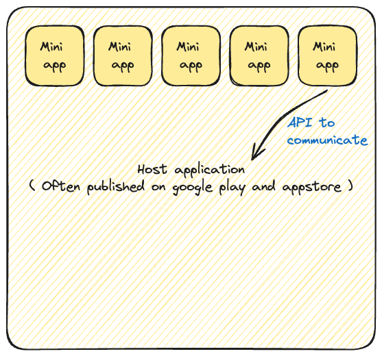

# what is mini app/program runtime environment?

**A mini app runtime environment:** is a lightweight platform or ecosystem that allows small, often specialized applications (mini apps) or sometimes called mini programs to run within a larger application or framework. Here are the basics:

- **Mini Apps or (Mini programs):** These are small, standalone applications designed to perform specific tasks. They are often simpler and faster than full-fledged applications.

- **Host Application:** This is the main application that provides the environment for mini apps to run. For example, a social media platform or an e-commerce app can act as a host for various mini apps.

- **Runtime Environment:** This refers to the infrastructure and tools that allow mini apps to run. It includes the necessary libraries, APIs (Application Programming Interfaces), and services that mini apps use to function.
