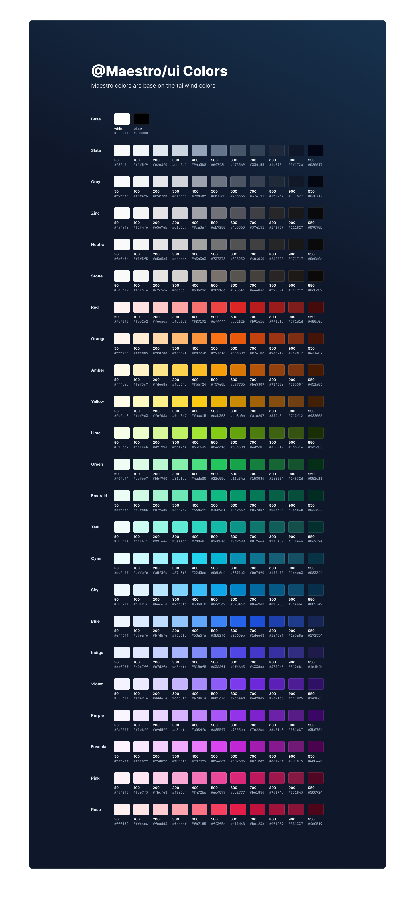

# Color schemes

Customizing the default color palette for your project.

Tailwind includes an expertly-crafted [default color palette](https://tailwindcss.com/docs/customizing-colors) out-of-the-box that is a great starting point if you don’t have your own specific branding in mind.

