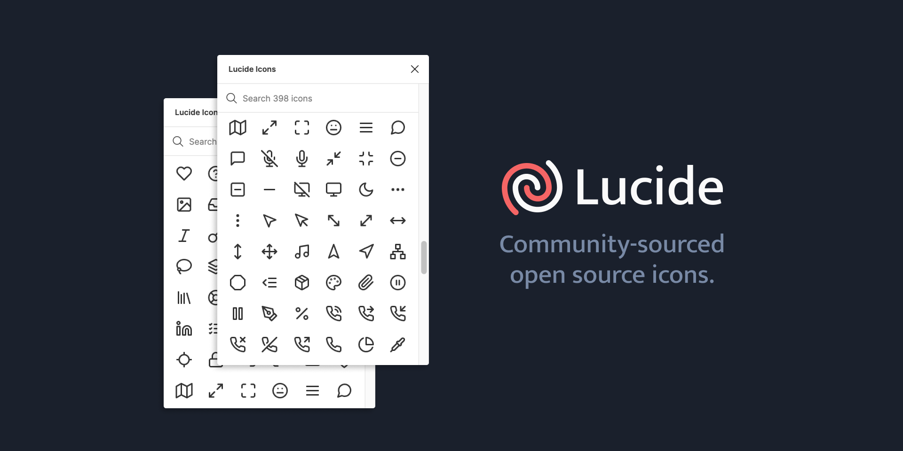

# Iconography

As Icons you should use [Lucide](https://lucide.dev/) as icon pack for you design since its icons are lightweight, highly optimized scalable vector graphics (SVG).

### Resources
- [Lucide Figma icon pack](https://www.figma.com/community/plugin/939567362549682242/lucide-icons)